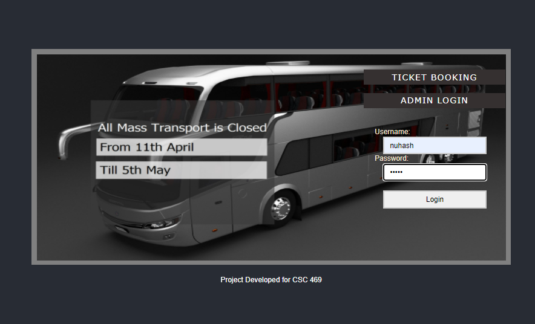
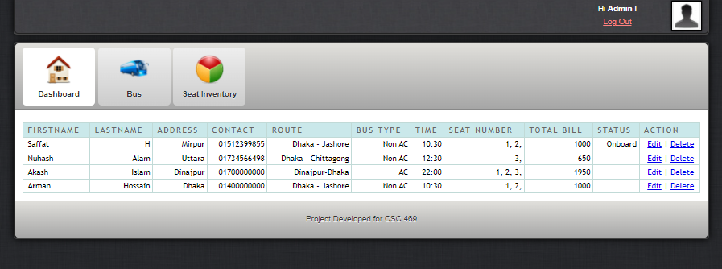
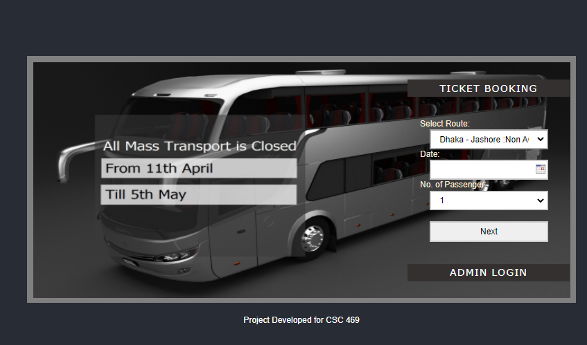
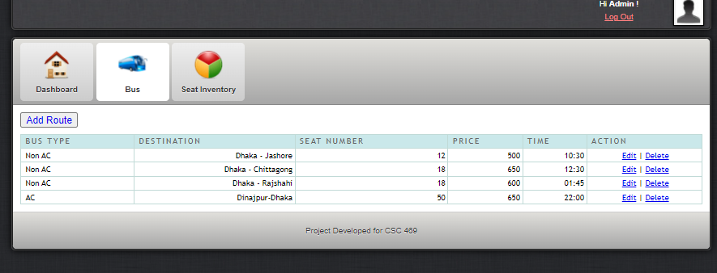
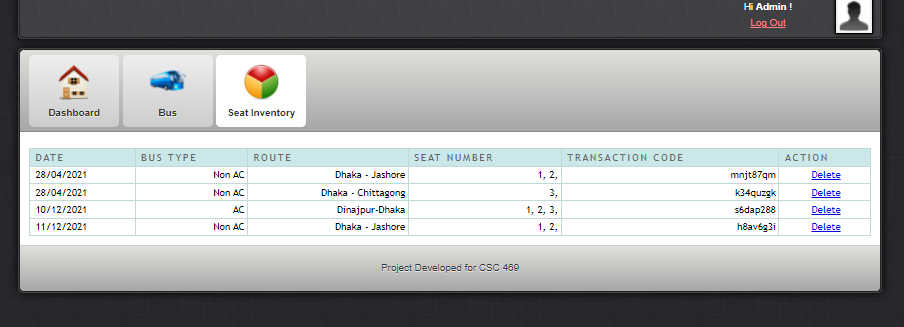
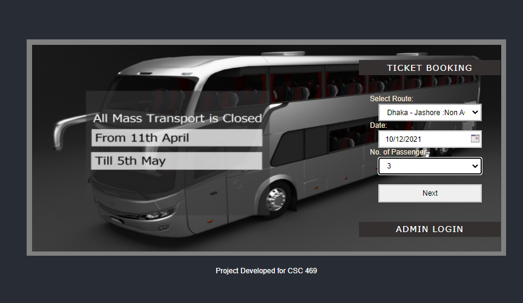
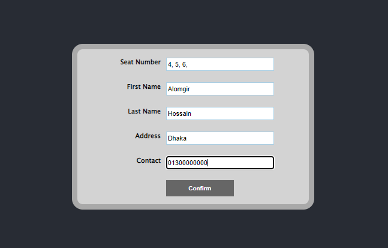
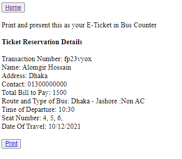
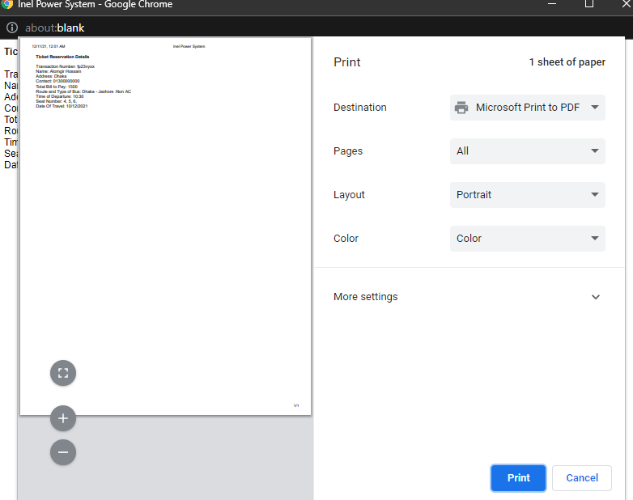

Bus E-Ticketing System using PHP and MySQL

This project Bus E-Ticketing System has been developed on PHP and MySQL. The main purpose for developing this project can helps admin to manage the bus details and user to book for the buses. This application is very simple and easy to access. 
Modules and Description of Bus E-Ticketing System Project:
Functionality of the Bus E-Ticketing System:
These are the functionality performed by the project:

1. Login For Admin
2. Logout Functionality
3. Dashboard for Admin 
4. Booking Ticket panel for the user

View Bus Booking Module:
This module provides all the functionality related to booking of the buses. It shows all the information and details of the booking person. 

1. Admin can add see the booking bus details
2. Admin can see the booking person information
3. Admin can update the status (Onboard/Not Void)
4. Admin can delete the booking person information

Bus Module:
This module provides all the functionality related to buses. It tracks all the information and details of the buses. Admin can do all the CRUD (Create, Read, Update and Delete) operations of the buses. 

1. Admin can add new buses records
2. Admin can see the list of buses details
3. Only admin can edit and update the record of the buses
4. Admin will be able to delete the records of the buses

Seat Inventory Module:
This module provides all the functionality related to bus seats. It tracks all the information and details of the seats. 

1. Admin can see the list of seat details of buses
2. Admin will be able to delete the records of the seat details

Booking Module:
This module provides all the functionality related to booking. It shows all the information and details of the buses and gives the access for booking of it. After providing the personal information and quantity, the user can book for the buses.

1. User can see the list of buses details
2. User can book for the buses
3. User can print the soft copy/ e-ticket of the bus

Technology used for this project:

1. HTML: Page layout has been designed in HTML
2. CSS: CSS has been used for all the designing part
3. JavaScript: JavaScript has been used to add dynamic behavior to the webpage and special effects to the webpage. On websites, it is mainly used for validation purposes.
4. PHP: All the frontend logic has been implemented in PHP that makes dynamic and interactive webpage.
5. MySQL : MySQL database has been used as database for the project

Supported Operating Systems:
We can configure this project on following operating system.

1. Windows: This project can easily be configured on windows operating system. For running this project on Windows system, you will have to install WAMP or XAMP on your system.
2. Linux: We can run this project also on all versions of Linux operating system. You will have to install WAMP or XAMP on your system.

Project Made By
Md. Nuhash Alam,
Email: nuhash.rijvi@gmail.com

